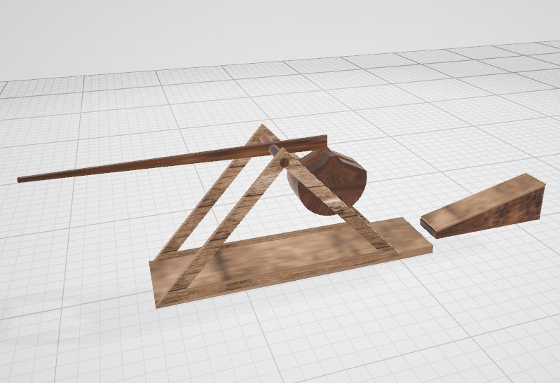

# bevy_trebuchet
### Bevy crate for creation  of an ancient siege weapon known as a trebuchet.  

## Why ?
I decided to make a trebuchet from the [Project Siege](https://github.com/xenon615/siege) as a crate.  
Why ? May be for convenience, may be for learning how to make crates, IDK :) .  


## Video 
[](https://youtu.be/K_OJGsxl0fk)

## Disclaimer
Actually its my first crate made for Bevy or Rust. So  maybe I didn't do it the way it should be or the way it's usually done.
Keep this in mind if you plan to use it. However, you free to copy, clone and correct it at your own discretion.
Also, I would be glad to receive any advice. ([xenon615 on Discord](https://discordapp/users/xenon615))

## Usage
Add to your dependencies
```
bevy_trebuchet = {git = "https://github.com/xenon615/bevy_trebuchet"}

```

Please refer to /examples/basic.rs for example. 

Also you can run for demo.

```
cargo run  --example basic

```

## To-Do
All we can do now is place the trebuchet in a certain position.
Therefore, the immediate plans are to allow it to be installed at any angle relative to the Y axis
(currently, an attempt to install it not strictly north causes its destruction) (IDK at the moment, why?)  
Next, at the moment trebuchet starts working automatically after creation  after which it starts working automatically.
So need add some control ( start / stop at least)  
Well, I'll add something else.


